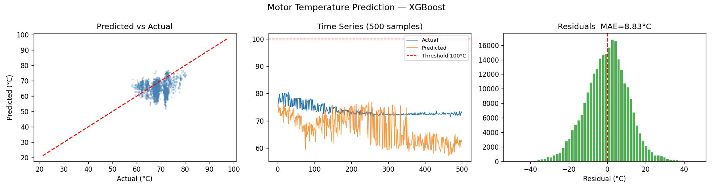

# 🔥 Motor Temperature Prediction — Project B5

Dự báo nhiệt độ động cơ PMSM để tránh quá nhiệt, sử dụng **XGBoost Regressor** trên dataset thực đo từ Kaggle.

---

## 📌 Mô tả

Mô hình học máy dự đoán nhiệt độ nam châm vĩnh cửu (`pm`) của động cơ PMSM dựa trên các tín hiệu điện (dòng điện, điện áp, tốc độ, mô-men xoắn). Kết quả được hiển thị qua **web app Flask** với cảnh báo real-time khi nhiệt độ tiếp cận ngưỡng nguy hiểm.

| Chỉ số | Giá trị |
|--------|---------|
| Model  | XGBoost Regressor |
| MAE (Test) | 8.83°C |
| Ngưỡng cảnh báo `pm` | ≥ 85°C ⚠️ / ≥ 100°C 🔴 |
| Số features | 17 (8 gốc + 9 engineered) |

---

## 📁 Cấu trúc project

```
motor-temp-prediction/
├── traindata.py              # Pipeline huấn luyện mô hình
├── demo.py                   # Flask web app demo
├── measures_v2.csv           # Dataset (tải từ Kaggle)
├── models/
│   ├── model_xgboost.joblib  # Model XGBoost đã train
│   ├── scaler.joblib         # StandardScaler đã fit
│   ├── metadata.json         # Feature list, ngưỡng, kết quả
│   └── training_results.png  # Biểu đồ kết quả
├── results.png               # Biểu đồ xuất ra
└── README.md
```

---

## ⚙️ Cài đặt

**Yêu cầu:** Python 3.8+

```bash
pip install pandas numpy scikit-learn xgboost matplotlib seaborn joblib flask
```

---

## 🚀 Hướng dẫn chạy

### Bước 1 — Tải dataset

Tải file `measures_v2.csv` từ Kaggle và đặt vào thư mục gốc:

👉 https://www.kaggle.com/datasets/wkirgsn/electric-motor-temperature

### Bước 2 — Huấn luyện mô hình

```bash
python traindata.py
```

Script sẽ tự động:
- Load và khám phá dữ liệu
- Feature engineering (17 features)
- Train 3 mô hình: Ridge, Random Forest, XGBoost
- Đánh giá và chọn model tốt nhất
- Lưu model vào thư mục `./models/`
- Vẽ biểu đồ kết quả

### Bước 3 — Chạy demo

```bash
python demo.py
```

Mở trình duyệt tại: **http://127.0.0.1:5000**

---

## 🖥️ Giao diện demo

Web app cho phép:
- Điều chỉnh thông số motor bằng thanh kéo (tốc độ, mô-men, dòng điện, điện áp, nhiệt độ)
- Chọn 4 kịch bản nhanh: **Không tải / Bình thường / Tải nặng / Quá nhiệt**
- Xem dự báo nhiệt độ 4 thành phần: PM, Stator yoke, Stator tooth, Stator winding
- Cảnh báo màu sắc real-time + biểu đồ lịch sử nhiệt độ

---

## 📊 Kết quả



- **Predicted vs Actual**: điểm dự đoán bám sát đường lý tưởng trong vùng 60–80°C
- **Time Series**: mô hình theo dõi đúng xu hướng nhiệt độ
- **Residuals**: phân phối chuẩn quanh 0, MAE = 8.83°C

---

## 🛠️ Chi tiết kỹ thuật

### Features

| Nhóm | Feature |
|------|---------|
| Gốc (8) | `ambient`, `coolant`, `u_d`, `u_q`, `motor_speed`, `torque`, `i_d`, `i_q` |
| Engineered (9) | `electrical_power`, `i_magnitude`, `u_magnitude`, `temp_diff_ambient_coolant`, `heat_load`, `i_mag_roll_mean_10/30`, `power_roll_mean_10/30` |

### Ngưỡng cảnh báo

| Thành phần | Cảnh báo | Nguy hiểm |
|------------|----------|-----------|
| PM (nam châm) | ≥ 85°C | ≥ 100°C |
| Stator yoke | ≥ 102°C | ≥ 120°C |
| Stator tooth | ≥ 102°C | ≥ 120°C |
| Stator winding | ≥ 102°C | ≥ 120°C |

---

## 📚 Dataset

- **Nguồn**: Kaggle — [Electric Motor Temperature](https://www.kaggle.com/datasets/wkirgsn/electric-motor-temperature)
- **Tác giả**: wkirgsn
- **Kích thước**: ~998.000 mẫu, tần số 2 Hz
- **Split**: 80% train / 20% test (giữ thứ tự thời gian)
